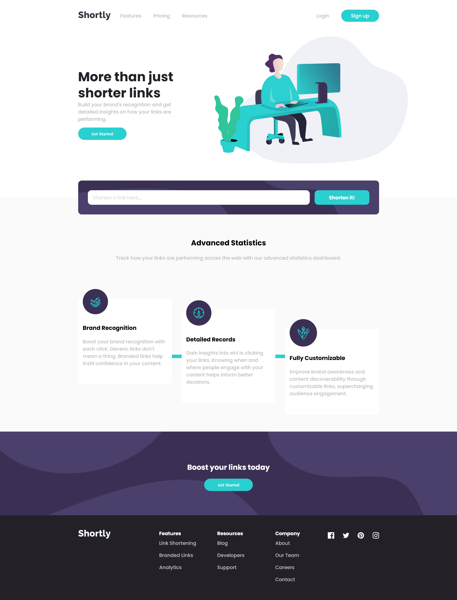

# Frontend Mentor - Shortly URL shortening API Challenge solution

This is a solution to the [Shortly URL shortening API Challenge challenge on Frontend Mentor](https://www.frontendmentor.io/challenges/url-shortening-api-landing-page-2ce3ob-G). Frontend Mentor challenges help you improve your coding skills by building realistic projects. 

## Table of contents

- [Overview](#overview)
  - [The challenge](#the-challenge)
  - [Screenshot](#screenshot)
  - [Links](#links)
- [My process](#my-process)
  - [Built with](#built-with)
  - [What I learned](#what-i-learned)
  - [Continued development](#continued-development)
- [Author](#author)


## Overview

### The challenge

Users should be able to:

- View the optimal layout for the site depending on their device's screen size
- Shorten any valid URL
- See a list of their shortened links, even after refreshing the browser
- Copy the shortened link to their clipboard in a single click
- Receive an error message when the `form` is submitted if:
  - The `input` field is empty

### Screenshot




### Links

- Solution URL: [Add solution URL here](https://github.com/Sengsith/short-url)
- Live Site URL: [Add live site URL here](https://ahreo-shorturl.netlify.app/)

## My process

### Built with

- Semantic HTML5 markup
- CSS custom properties
- Flexbox
- Mobile-first workflow
- [React](https://reactjs.org/) - JS library
- [SASS](https://sass-lang.com/) - CSS Preprocessor

### What I learned

I mainly wanted to do this challenge to practice API calls which I did within my Shorten.jsx file:

```js
// API call to shrt code using async await
const shortenURL = async (url) => {
  // Check if the url is empty
  if (!url || !url.trim()) return;
  // Check if url doesn't end with .com
  if (!url.endsWith('.com')) return;

  const apiURL = `https://api.shrtco.de/v2/shorten?url=${url}`;
  try {
    const response = await fetch(apiURL);
    const data = await response.json();
    const shortUrlResult = data.result.full_short_link;

    // Check if shortUrlResult is undefined
    if (shortUrlResult === "undefined") return;
    // Create new object and append to passed in prop to send back to parent so we can render out the link cards
    const newItem = {link: inputValue, shortLink: shortUrlResult};
    setShortenedLinks([...shortenedLinks, newItem]);  

    return shortUrlResult;
  } catch (error) {
    console.error(error);
    return null;
  }
}
```
I had issues testing with the API due to my ISP having issues whenever it was making the API call which explains why I had a few pushes that said something along the lines of "fixed api call". Before actually calling the API, I had to check to see if the url passed in was empty or if it ended with '.com' so that the API can properly make the call. After the API call is done, we make sure to see if the result returns "undefined" or not, otherwise we create a new object with the original link and the shortened link and pass it back to it's parent. Then outside in the next section is where we dynamically render the link cards for the user to view and copy links to their clipboard.

### Continued development

My CSS got pretty messy when playing around with the footer when setting up my media queries for the desktop layout. I got very confused when having multiple ul and nav tags nested within each other. To fix this in the future, I'll take it a bit more slow and give them proper class names to have an easier time keeping track of my styling. Overall, it's been a few months since I last did a react project from the time of completing this project so this was a great refresher.

## Author

- Frontend Mentor - [@sengsith](https://www.frontendmentor.io/profile/sengsith)
